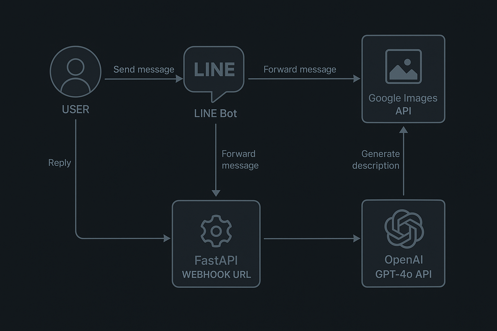

> 閱讀警告：以下內容均有經過 ChatGPT 進行內容擴寫與潤飾

## 🧚‍♀️ Picture Fairy：從 AI 熱潮到互動原型

在接觸了幾部免費的 Python 教學影片後，發現學習資源真的非常豐富，也激起我想實作一個自己的程式專案。當時生成式 AI 正在大爆發，我決定搭上這波浪潮，動手做一個結合 AI 的簡單互動應用。

就這樣，Picture Fairy 誕生了 —— 我知道命名有待加強（笑）。

Picture Fairy 的功能很直觀：
使用者輸入一段文字關鍵詞，後端會：
1. 透過 Google 圖片搜尋抓出一張代表性的圖片  
2. 同時使用 GPT-4o 為該詞彙生成一段說明文字

圖片與文字分別來自不同來源，因此兩者不一定會精準對應，但這種 AI 組合包的趣味性，有時反而讓結果更有「想像空間」。

---

## 🤖 LINE Bot + Webhook 架構補充

這個應用實際上是透過 **LINE Messaging API** 來與使用者互動的。使用者在 LINE 中輸入一段文字後：

1. LINE Bot 將訊息透過 webhook 傳送到部署好的 FastAPI 應用伺服器。
2. FastAPI 取得使用者輸入，接著：
    - 串接 Google 圖片搜尋邏輯抓圖
    - 同時呼叫 OpenAI 的 GPT-4o API 生出文字說明
3. 最後將圖＋文回覆給使用者。

以下是流程圖簡圖：

---

## ⚙️ 技術架構簡介

專案技術組合選擇盡量以輕量為主：

- **後端框架：** FastAPI（處理 webhook 與 API 邏輯）
- **圖片來源：** Google 圖片搜尋（模擬簡易搜尋 API）
- **文字生成：** OpenAI GPT-4o（使用自然語言生成說明）
- **訊息平台：** LINE Bot Messaging API + Webhook
- **部署與測試：** gunicorn + ngrok + tmux（支援本機測試與遠端背景執行）
- **套件管理：** uv（以 pyproject.toml 管理依賴與虛擬環境）

---

## 🧠 全程與 ChatGPT 協作開發的經驗

Picture Fairy 幾乎是我第一次從頭到尾用 Python 完成一個應用程式，過程中幾乎每一步都在與 ChatGPT 對話、請教，才慢慢堆疊出可以運作的雛形。

### 1. 生出程式碼很快，但讓它跑起來並不簡單（要能辨識真偽）
許多程式碼「看起來合理」，但實際執行會遇到錯誤。我的做法是查官方文件、請 ChatGPT 附連結來源、自行搜尋錯誤訊息。

### 2. 初期目標是「能動」，看懂八成都值得開心
配合 ChatGPT 解釋、官方文件查詢與實際微調，我逐漸理解 FastAPI 與 webhook 運作，掌握整體邏輯。

### 3. 將與 ChatGPT 的對話內容分類保存，有助於後續查找
我建議把與 ChatGPT 的對話依功能模組整理，方便 debug 與問題追蹤。

---

## 🧪 遇到的挑戰與未來想做的功能

### 遇到的問題：

- **圖片與文字不一定能對上：** 圖片來自搜尋，文字來自 GPT，兩者語意未必相符。
- **Google 搜圖不穩定：** 有時無法成功擷取圖片，需 fallback。

### 未來想做的功能：

- 嘗試能根據圖片自動生成相對應的文字描述（Image Captioning）

---

## 🏁 小結：這不只是程式練習，也是一次與 AI 的協作體驗

Picture Fairy 對我來說不只是練習 Python，更是我第一次「與 AI 合作做出完整應用」的經驗。從設計邏輯、API 串接、debug 到最後跑起來，都是第一次，也是一次充滿挫折與成就感的旅程。

這樣的學習方式不像教科書，而是：用問題學、用實作學。
我想，這就是我未來還會繼續走下去的方向。

➡️ GitHub 專案連結：[https://github.com/hunkue/picture-fairy](https://github.com/hunkue/picture-fairy)