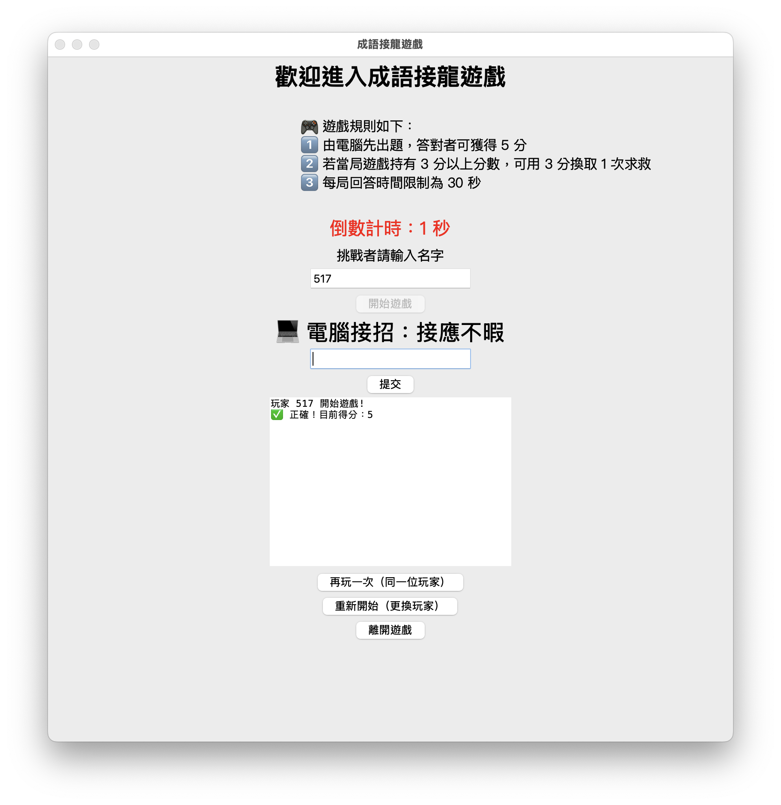

> 閱讀警告：以下內容均有經過 ChatGPT 進行內容擴寫與潤飾

## 🎮 中文成語接龍遊戲：從命令列走向非同步 GUI 的進化

做第二個專案的時候，想著要進行更進一步的練習和應用，當時正好學到了資料庫相關的內容，生活中的經驗則讓我回想起文字接龍遊戲的記憶，於是決定就將這個遊戲透過 Python 實踐看看。

附上遊戲畫面截圖：

題外話，我甚至在拿到成語典的資料後，才發現很多日常中說的詞語，其實都不能算是成語，以至於當我在測試遊戲時，我其實得開著成語典的資料邊查邊玩，才不會在第一輪就輸給電腦 😅。這個發現也讓我有了後續想法：或許之後能把遊戲資料庫擴充成一般詞語的接龍機制，讓遊戲更有彈性與樂趣！

這個專案的開發最想分享的兩個挑戰如下：

---

## 🧱 CLI 與 GUI：不同程式設計思維的實戰轉換

專案的兩個主要入口分別是：

- `main.py`：命令列介面（CLI）版本
- `idiom_chain.py`：圖形介面（GUI）版本

最初是從 CLI 版本著手，讓我專注在遊戲邏輯與資料庫查詢整合上。這時使用者透過文字輸入接龍內容，程式依序回應結果，整體流程是線性、可預期的。

但進一步希望讓遊戲具有作品感時，便開始嘗試 `tkinter` 圖形介面的開發。GUI 架構主要由 `idiom_chain.py` 啟動，並整合以下模組完成完整邏輯：

- `game.py`：成語接龍規則與邏輯判斷（例如檢查是否能接、誰勝誰負）  
- `idiom_database.py`：從資料庫中查詢是否為合法成語，以及可能的接龍結果  
- `game_manager.py`：協調 GUI 控制流程，例如電腦回合、倒數計時結束後自動判定輸贏  
- `records_database.py`：儲存玩家與電腦的勝場紀錄  
- `game_timer.py`：提供非同步的倒數計時功能  

相對於 CLI 的「指令 → 回應 → 結束」流程，GUI 則是事件導向（event-driven），每一次的使用者輸入、電腦出手、倒數結束都可能隨時打斷目前流程，這讓我必須將邏輯與畫面顯示層拆開設計，並確保模組間的解耦。

---

## ⏱️ 非同步倒數計時：從卡住畫面的問題，到 asyncio 的穩定解法
一開始我在開發 CLI 版本的時候，就嘗試加入「每回合限時 30 秒」的倒數計時功能。當時我用 threading.Thread() 來處理背景倒數，理論上它能在不阻塞主程式的情況下進行計時。

但實際執行時卻發現問題很多：

- 倒數計時會卡住，導致使用者沒辦法順利輸入成語
- 有時候會同時啟動多個計時器，導致畫面上倒數數字重複跳動或混亂
- 雖然是 CLI 環境，但仍能感受到同步執行的限制和混亂

後來我改用 Python 的 asyncio 非同步協程來重寫倒數邏輯，成功讓 CLI 的倒數計時變得更穩定且準確。

等到進入 GUI 版本（用 tkinter 製作）後，我就直接延續這個非同步寫法，並進一步在 game_timer.py 中封裝成獨立模組，與畫面互動的部分也同步精進。

這樣做有幾個好處：

### ✅ 為什麼選擇 `asyncio`？

- **不會卡住畫面**：倒數過程中，主畫面還是能正常顯示與操作，不會被暫停
- **可以中途取消倒數**：若玩家在時間結束前就輸入好答案，可以立即取消計時器，避免出現「時間到了但已經完成」的錯亂
- **更適合單執行緒的 GUI 應用**：不像 threading 需要處理跨執行緒的問題，asyncio 可以在同一個主流程內就完成任務切換，對 GUI 來說更安全

這個實作讓我更加理解了「同步 v.s. 非同步」的核心差異：

| 類型       | 說明                                             |
|------------|--------------------------------------------------|
| 同步（Synchronous） | 一次只能做一件事，等前一個動作做完才能進下一步 |
| 非同步（Asynchronous） | 可以在等待操作（如 sleep, I/O）時執行其他任務，提升效能與互動性 |

非同步程式設計一開始不太直觀，但實際操作過後，特別在 `asyncio` + GUI 結合下，真的讓我感受到其強大與必要性。

---

這兩個面向（GUI 架構與非同步控制）不只讓我加深對 Python 事件處理與協程模型的理解，也成為我未來想開發更大型互動式應用的重要基礎。

接下來我也會思考如何將這個專案進一步發展為 Web 應用，並可能嘗試與 Django 結合，讓這個遊戲能夠分享到網路上與更多人互動 🎯

---

👉 [🔗 查看完整 GitHub 專案](https://github.com/hunkue/chinese-idiom-chain-game)